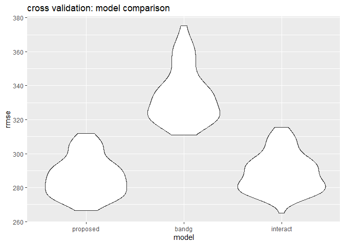

191125\_HW6
================
Gavin Ko
11/17/2019

# Problem 1

First, import the data set and mutate to correct type:

``` r
baby_df = read.csv("data/birthweight.csv", header = T)

# coerce numeric columns into factor
baby_df = 
  baby_df %>% 
    mutate(
      babysex = as.factor(babysex),
      frace = as.factor(frace),
      malform = as.factor(malform),
      mrace = as.factor(mrace))
```

After data cleaning, we can now check the distribution of birth weight
of the babies.

``` r
baby_df %>% 
  select(bwt) %>% 
  ggplot(aes(x = bwt)) + 
  geom_density() + 
  labs(
    title = "density plot of birth weight",
    x = "birth weight(grams)")
```

<!-- -->

Accordingly, the data distribution is slightly left skewed but the
general trend looks normal. Therefore, we’re allowed to perform ordinary
linear regression.

I would propose a model to predict the baby’s weight from the baby’s own
characteristics : `bhead` as baby’s head circumference, `blength` as
it’s length at virth and `gaweeks` as gestational age in weeks, with
their interactions. All of these factors are persumed to be related to
the baby’s weight.

``` r
lm_proposed = lm(bwt ~ bhead * blength * gaweeks, data = baby_df)
```

Before doing the comparison, we should check if the residual is related
to the fitted value:

``` r
baby_df %>% 
add_residuals(lm_proposed) %>% 
add_predictions(lm_proposed) %>% 
  ggplot(aes(x = pred, y = resid)) + 
  geom_point() + 
  geom_line(y = 0, color = "red") + 
  labs(
    title = "residual vs fitted value plot",
    x = "fitted value(gram)",
    y = "residuals"
  )
```

<!-- -->

According to the graph, the variance of residual seems to be even across
the fitted values, except two outliers on the upper left, which is a
trivial number compared to our sample size.  
Now, it’s time for cross validations. I’m utilizing RMSE as my comparing
index.

``` r
# set the automate train/test splitting process
cv_df = 
  crossv_mc(baby_df, 100)

# set the dataframe for cv purpose
cv_df = 
  cv_df %>% 
  mutate(
    train = map(train, as_tibble),
    test = map(test, as_tibble))

# fitting models
cv_df = 
  cv_df %>% 
  mutate(
    lm_proposed = map(train, ~lm(bwt ~ bhead * blength * gaweeks, data = .x)),
    lm_bandg = map(train, ~lm(bwt ~ blength + gaweeks, data = .x)),
    lm_interact = map(train, ~lm(bwt ~ bhead * blength * babysex, data = .x))
    ) %>% 
  mutate(
    rmse_proposed = map2_dbl(lm_proposed, test, ~rmse(model = .x, data = .y)),
    rmse_bandg = map2_dbl(lm_bandg, test, ~rmse(model = .x, data = .y)),
    rmse_interact = map2_dbl(lm_interact, test, ~rmse(model = .x, data = .y))
  )

# plot the rmse

cv_df %>% 
  select(starts_with("rmse")) %>% 
pivot_longer(
    everything(),
    names_to = "model", 
    values_to = "rmse",
    names_prefix = "rmse_") %>% 
  mutate(model = fct_inorder(model)) %>% 
  ggplot(aes(x = model, y = rmse)) + geom_violin() + 
  labs(
    title = "cross validation: model comparison"
  )
```

<!-- -->

As shown in the plot, the proposed model have the best rmse outcome, but
it’s merely a slight improvement compared to the model having head
circumference, length and sex.

# Problem 2

First, download the data.

``` r
weather_df = 
  rnoaa::meteo_pull_monitors(
    c("USW00094728"),
    var = c("PRCP", "TMIN", "TMAX"), 
    date_min = "2017-01-01",
    date_max = "2017-12-31") %>%
  mutate(
    name = recode(id, USW00094728 = "CentralPark_NY"),
    tmin = tmin / 10,
    tmax = tmax / 10) %>%
  select(name, id, everything())
```

    ## Registered S3 method overwritten by 'crul':
    ##   method                 from
    ##   as.character.form_file httr

    ## Registered S3 method overwritten by 'hoardr':
    ##   method           from
    ##   print.cache_info httr

    ## file path:          C:\Users\good_\AppData\Local\rnoaa\rnoaa\Cache/ghcnd/USW00094728.dly

    ## file last updated:  2019-09-26 10:26:06

    ## file min/max dates: 1869-01-01 / 2019-09-30

Since we’ve got the data, now it’s time for constructing the boot
strapping function.

``` r
boot_collect = function(df) {
  sample_frac(df, replace = T)
  }

boot_df = 
  tibble(
    strap_id = 1:5000,
    strap_sample = rerun(5000, boot_collect(weather_df))
    )
```

After creating the bootstrap samples, we can fit linear model inside.

``` r
boot_results = 
  boot_df %>% 
  mutate(
    models = map(strap_sample, ~lm(tmax ~ tmin, data = .x)),
    r2_results = map(models, broom::glance), 
    coef_results = map(models, broom::tidy)) %>% 
  select(-strap_sample, -models) %>% 
  unnest() %>% 
  select(strap_id, r.squared, adj.r.squared, term, estimate)
```
